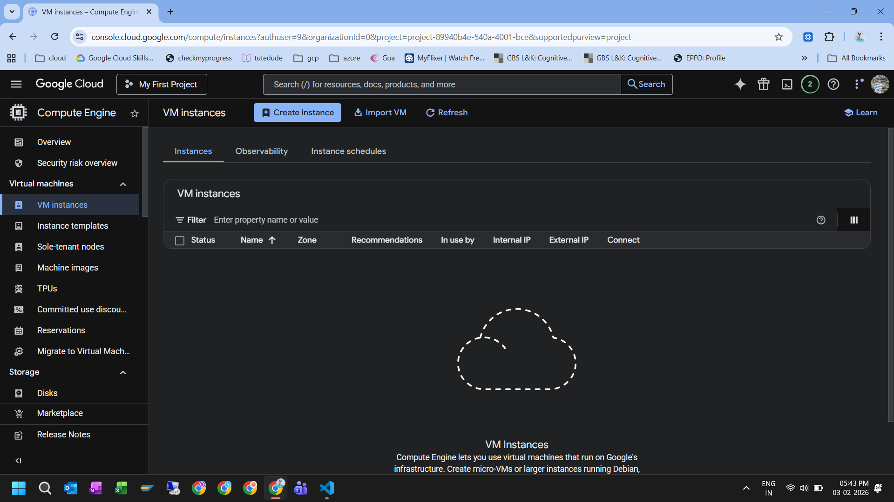
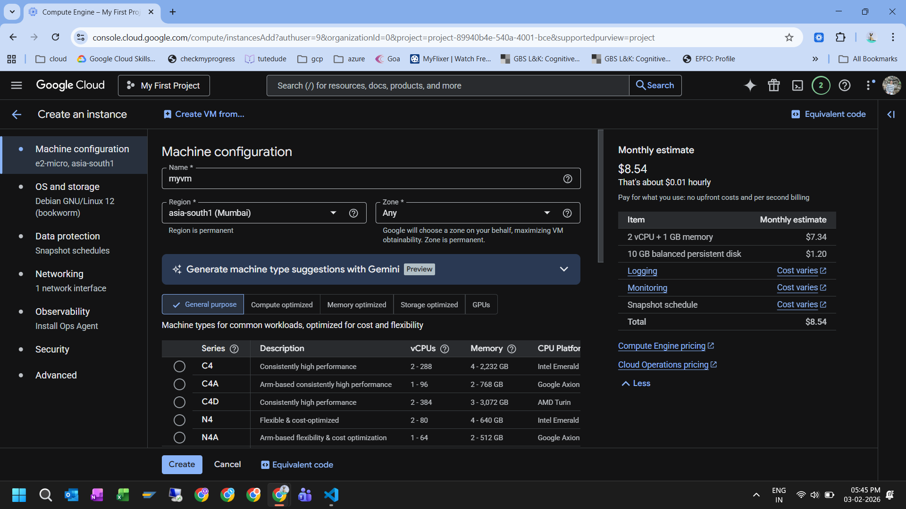
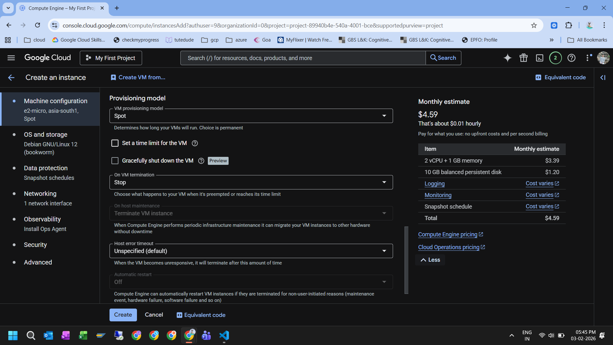
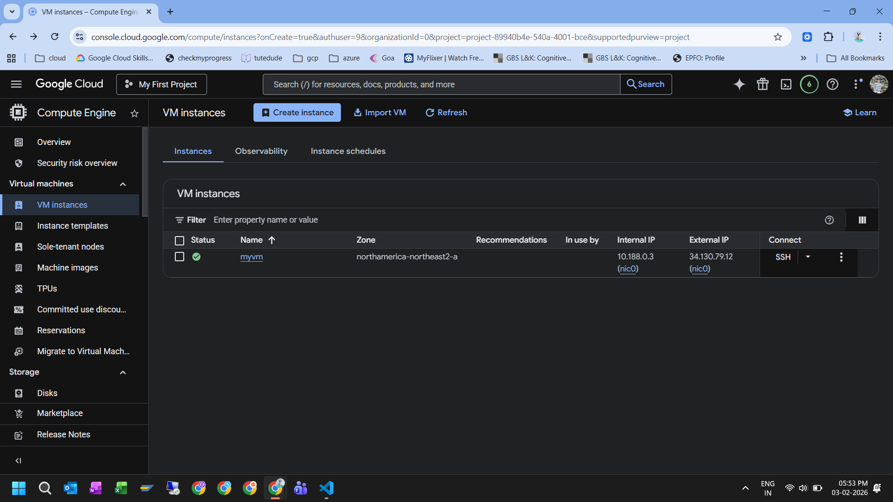
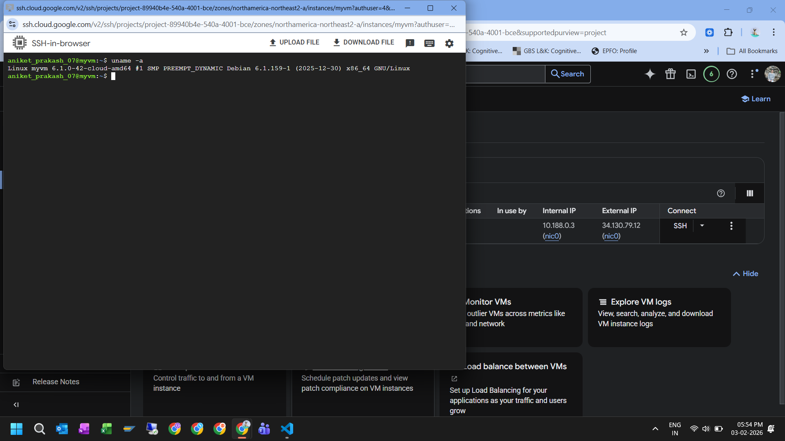
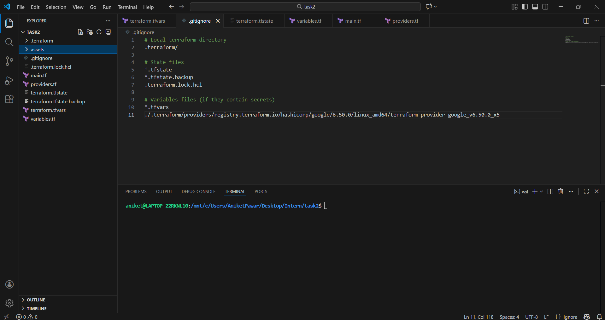
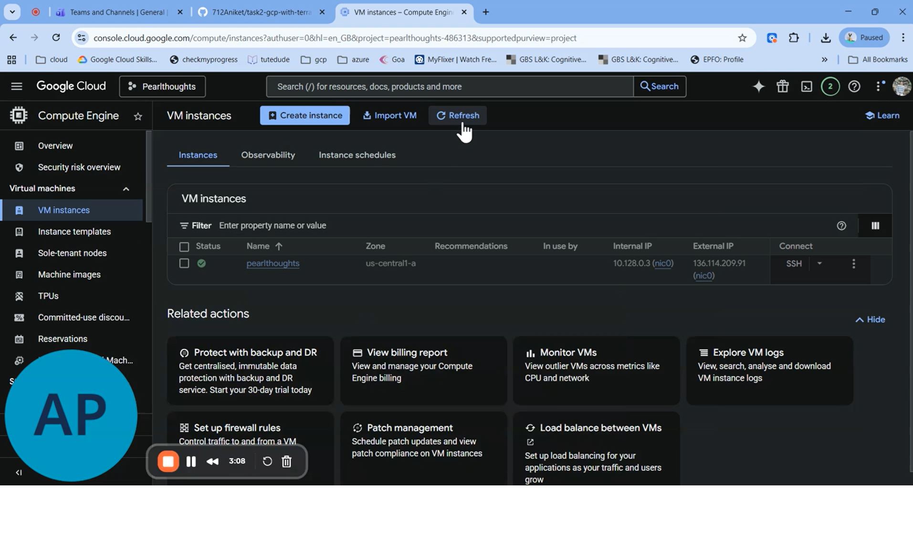

## Purpose of This Repository

I created this repository to learn Google Cloud Platform (GCP) fundamentals and to understand how infrastructure provisioning works both manually and using Terraform.

Instead of starting directly with automation, I first created resources manually to understand the underlying concepts, and then automated the same setup using Infrastructure as Code.

## Tools and Technologies Used

Cloud Platform: Google Cloud Platform (GCP)
Compute Service:Compute Engine
Infrastructure as Code: Terraform

## Part 1: Manual Compute Engine VM Creation (GCP Console)

I started by creating a Compute Engine VM manually using the GCP Console.  
This helped me understand the VM configuration options before moving to automation.

### Steps I followed:
1. Enabled the **Compute Engine API** for my project
2. Navigated to: Compute Enginer
3. Created a new VM with:
- Machine type: `e2-micro`
- OS: Debian / Ubuntu
- Disk: Standard persistent disk
- Region: `us-central1`
4. Connected to the VM using SSH-in-browser

This step gave me clarity on VM lifecycle, machine types, regions, and disk choices.

### Screenshots – Manual VM Creation

## Part 2: Provisioning the Same VM Using Terraform

After understanding the manual process, I used Terraform to automate the creation of a Compute Engine VM.

### Authentication Used

For this learning setup, I authenticated using my user credentials:

gcloud auth login

## Terraform files structure

├── provider.tf
├── main.tf
├── variables.tf
├── outputs.tf
├── terraform.tfvars
├── startup.sh
└── README.md

## Commands used to launch Compute Instance using Terraform

terraform init
terraform validate
terraform plan
terraform apply

### Screenshot – VM Launched Using Terraform

## Cleanup

After completing the learning exercise, I cleaned up resources using: terraform destroy
